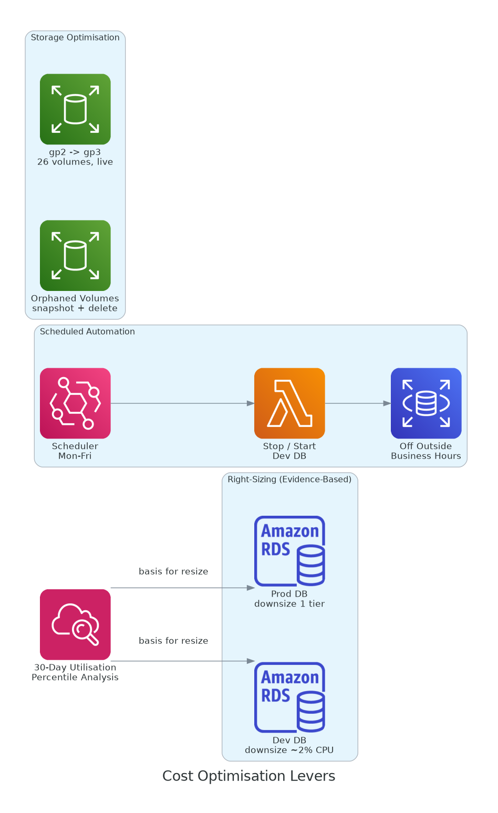

# AWS Cost Optimisation

A live-environment cost optimisation programme that reduced monthly AWS spend through right-sizing, storage class migration, scheduled automation, and orphaned resource cleanup, all executed with zero production downtime and full rollback plans.

---

## Overview

This project documents a structured cost optimisation effort across a production AWS environment with a monthly bill in the ~$13K range, where a single database engine accounted for over half of total spend. Rather than blunt cuts, the approach was an independent live audit, identifying genuinely safe savings backed by usage data, then executing each change as a documented, reversible operation.

Total verified savings from the first phase: **approximately $1,588/month (~$19,056/year)**.

---

## Method: Audit Before Acting

Every proposed saving was validated against live metrics before execution. A few principles enforced throughout:

- **Right-size on evidence, not guesswork.** Instance downsizing decisions were backed by 30-day CPU and connection percentiles, not assumptions.
- **Confirm before deleting.** Orphaned resources were snapshotted before deletion, and "unused" was verified against monitoring data, not inferred.
- **Never trust a stale audit.** A prior audit claimed dozens of unattached Elastic IPs; a live check found they were all attached. The discrepancy was flagged rather than acted on.

---

## Savings Delivered

| Change | Approach | Monthly Saving |
|---|---|---|
| Production DB right-size | Downsized one tier after percentile analysis | Largest single line item |
| Dev DB right-size | Downsized after confirming near-idle (~2% avg CPU) | ~$406 |
| Scheduled dev DB stop/start | Off outside business hours, weekdays only | Significant on dev compute |
| EBS gp2 → gp3 (26 volumes, 668 GB) | Live modify, no downtime | ~$13 |
| Orphaned EBS cleanup (250 GB) | Snapshot then delete | Removed ongoing charge |
| Aurora Auto Scaling threshold raise | 50% → 80% to stop transient scale-out | Avoided needless reader spend |

---

## Right-Sizing on Evidence

Before downsizing any database instance, usage was pulled over a 30-day window. A dev cluster averaging ~2% CPU with a maximum under 17% is a clear downsize candidate; a production instance needs more care and a smaller step.

```bash
# Pull 30-day CPU percentiles before deciding on a resize
aws cloudwatch get-metric-statistics \
  --namespace AWS/RDS \
  --metric-name CPUUtilization \
  --dimensions Name=DBInstanceIdentifier,Value=<instance-id> \
  --start-time $(date -u -d '30 days ago' +%Y-%m-%dT%H:%M:%SZ) \
  --end-time $(date -u +%Y-%m-%dT%H:%M:%SZ) \
  --period 86400 \
  --statistics Average Maximum

# Resize once the data supports it
aws rds modify-db-instance \
  --db-instance-identifier <instance-id> \
  --db-instance-class <smaller-class> \
  --apply-immediately
```

For the production instance, the resize was followed by a controlled manual failover to restore the correct writer role, planned into a low-traffic window.

---

## Scheduled Stop/Start for Non-Production

A non-production database cluster running 24/7 was costing full price for time nobody used it. An EventBridge Scheduler plus Lambda pattern stops it in the evening and starts it in the morning on weekdays only, cutting its compute cost substantially.

```bash
# Stop schedule: 18:00 weekdays
aws scheduler create-schedule \
  --name dev-db-stop \
  --schedule-expression "cron(0 18 ? * MON-FRI *)" \
  --schedule-expression-timezone "America/Chicago" \
  --flexible-time-window '{"Mode":"OFF"}' \
  --target '{"Arn":"<lambda-arn>","RoleArn":"<role-arn>","Input":"{\"action\":\"stop\"}"}'
```

Production was explicitly excluded: the morning warm-up delay is fine for dev, unacceptable for production.

---

## Storage and Orphaned Resources

```bash
# Live gp2 -> gp3 conversion, no downtime
aws ec2 modify-volume --volume-id <volume-id> --volume-type gp3

# Find orphaned (unattached) volumes
aws ec2 describe-volumes \
  --filters Name=status,Values=available \
  --query 'Volumes[*].{ID:VolumeId,Size:Size}' --output table

# Snapshot before deleting anything
aws ec2 create-snapshot --volume-id <volume-id> \
  --description "Pre-deletion safety snapshot"
aws ec2 delete-volume --volume-id <volume-id>
```

---

## Repository Structure

```
aws-cost-optimisation/
├── README.md
├── docs/
│   ├── diagrams/
│   │   └── cost-optimisation-architecture.png
│   ├── savings-summary.md
│   └── rightsizing-methodology.md
├── change-records/
│   ├── CR-ebs-gp3-migration.md
│   ├── CR-database-rightsizing.md
│   ├── CR-scheduled-stop-start.md
│   └── CR-orphaned-cleanup.md
└── scripts/
    ├── audit-rds-utilisation.sh
    ├── find-orphaned-resources.sh
    └── db-stop-start-lambda.py
```

---

## Tech Stack

- AWS RDS / Aurora, EC2, EBS, Lambda, EventBridge Scheduler
- AWS CloudWatch (utilisation analysis)
- AWS CLI, Python, Bash

> All resource identifiers, account IDs, instance classes, and internal naming have been sanitized. Savings figures are representative of the real outcome.

---

## Architecture Diagram


